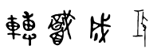

# 🌀【漢字シジル・プロトコル v0.1（試作版）】

## 🛠️ はじめに：祭壇での開式の祈り

**英語：**  
> By the power of sacred words, I open this work.  
> Let my intention take form.  
（聖なる言葉の力をもって、このワークを始めます。  
私の意図が形となりますように。）

---

## 📜 プロトコル手順

### 1. 自分の祭壇があれば、まず祈る

### 2. 願いを「漢字」で書く  
- 単語でも文章でもOK  
- シンプルでイメージしやすい言葉が良い  
  例：**「転職成功」「健康回復」「試験合格」**

### 3. その漢字を「甲骨文字・金文・篇文」で書く  
- 白川静『常用字解』などの資料を参考に  
- 参考リンク：[https://www.dl.is.ritsumei.ac.jp/Shirakawa/search/](https://www.dl.is.ritsumei.ac.jp/Shirakawa/search/)  
- 古代文字が存在しない場合は **万葉仮名や象形化の工夫** もOK

---

## ✍️ 例：願い「転職成功」  
以下は「転職成功」をテーマにした試作シジルです：

---

### 4. 魔法日記・影の書に 100回書く  
- 複数日に分けてOK  
- 書いている間は沈黙し、願いごと、自分の住所と名前を心で唱える  
- 書写によって深層意識への定着を図る

### 5. 祭壇でイメージを視覚化し、祈る

---

## 🔚 おわりに：祭壇での閉式の祈り

**英語：**  
> This work is done.  
> May the powers guide my path.  
（このワークはここに完了しました。  
力ある存在が私の道を導いてくれますように。）

---

## 補足：四文字漢字シジルという形式について

日本語では「四字熟語」の文化が根付いており、意味を四文字に凝縮して把握する感覚に長けています。
この習慣を応用して、シジルも四文字の漢字（例：売上向上、悪縁切除など）に集約することで、
視覚的にも呪術的にも扱いやすくなります。

意味が即座に伝わり、かつ篆書などで図像化することで、単なる言葉を越えた「呪」の役割を果たします。

### 範例：四文字シジル「売上向上」

下記は、四文字の漢字を篆書体で図像化した例です。

また、願いごとが長くなる場合は、四文字をブロックのように重ねていくことで対応できます。

たとえば「売上向上」「集客増加」「取引安泰」のように、
複数の意味ブロックを並べることで、より具体的で複層的な意図を視覚化することが可能です。

このような形で、四文字の漢字シジルを「呪術的レゴブロック」として扱い、
目的に応じて組み替えたり、積み重ねたりすることで、柔軟かつ実用的な魔術ツールとして活用できます。

---

## 💡 備考

- このプロトコルは「日本語話者のための実用的な呪術形式」として開発中です  
- 西欧の儀式魔術と東洋の象形文化を融合した新しいアプローチです  
- 本プロトコルは **クリエイティブ・コモンズ (CC BY-NC-SA)** で提供予定

---

## 🚧 バージョンとライセンス

- Version: 0.1 (試作)  
- License: CC BY-NC-SA (表示-非営利-継承)

---

## 💬 開発と問合せ  
- 開発者：Ravensgate  
- メール：[ravensgate2025@gmail.com](mailto:ravensgate2025@gmail.com)  
- GitHub: [https://github.com/ravensgate-tux](https://github.com/ravensgate-tux)

---

🌐 English Summary (for international readers)

🌀 Kanji Sigil Protocol v0.1 (Prototype)
This is an experimental protocol designed to create and activate sigils using Chinese characters (Kanji) as magical symbols. It is inspired by traditional Japanese culture, local folk customs, and the esoteric structure of ritual magick.

The core idea is to:
Write your intention in simple Kanji.
Reconstruct it using ancient forms (oracle bone script, bronze inscriptions, etc.).
Repetition through handwriting (like the Japanese custom of "100 prayers").
Visualization and ritual affirmation at your altar.
This method seeks to localize Western magical practices for Japanese practitioners and explore the deep symbolic roots of the written language.
The act of handwriting is not only for repetition, but also a form of meditative enchantment. In this context, ancient characters function both as mnemonic and energetic forms.

📚 References and Inspiration
This project is deeply inspired by the research of Shirakawa Shizuka, especially his works on the origin and magical nature of Kanji:

Jouyou Jikai (常用字解)
Jitou (字統)
The Thought of Spells (呪の思想)

---

📄 License

© 2025 知られざる呪術師（Le Sorcier Inconnu）  
本ドキュメントは [Creative Commons BY-SA 4.0](https://creativecommons.org/licenses/by-sa/4.0/deed.ja) に基づき公開されています。
